# Data Modeling in the Modern Data Stack

> Notes on data modeling approaches, warehouse architectures, and pipeline patterns.

---

## Table of Contents
1. [Data Modeling Approaches](#data-modeling-approaches)
2. [Data Warehouse Architectures](#data-warehouse-architectures)
3. [Batch vs Stream / Lambda Architecture](#batch-vs-stream--lambda-architecture)
4. [Databricks Reference Architectures](#databricks-reference-architectures)

---

## Data Modeling Approaches

### 1. Normalized Modeling — Bill Inmon

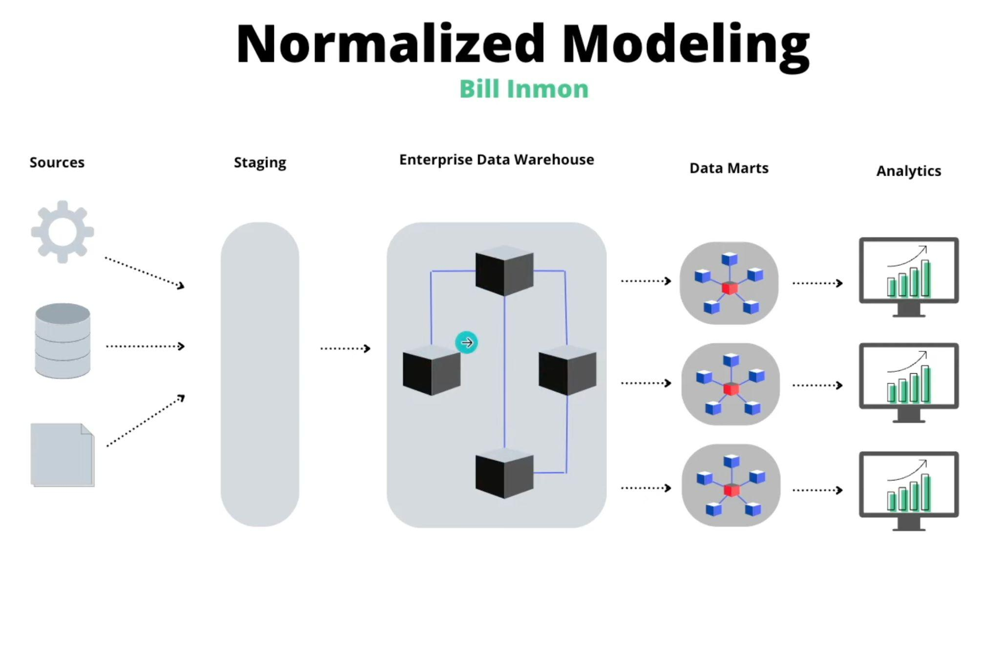

- **Approach:** Build a fully normalized Enterprise Data Warehouse (EDW) first, then create denormalized Data Marts for specific business units.
- **Flow:** Sources → Staging → Enterprise DW (normalized 3NF) → Data Marts → Analytics
- **Pro:** Single source of truth, less data redundancy
- **Con:** Complex joins, slower query performance for analytics

---

### 2. Denormalized Modeling — Ralph Kimball

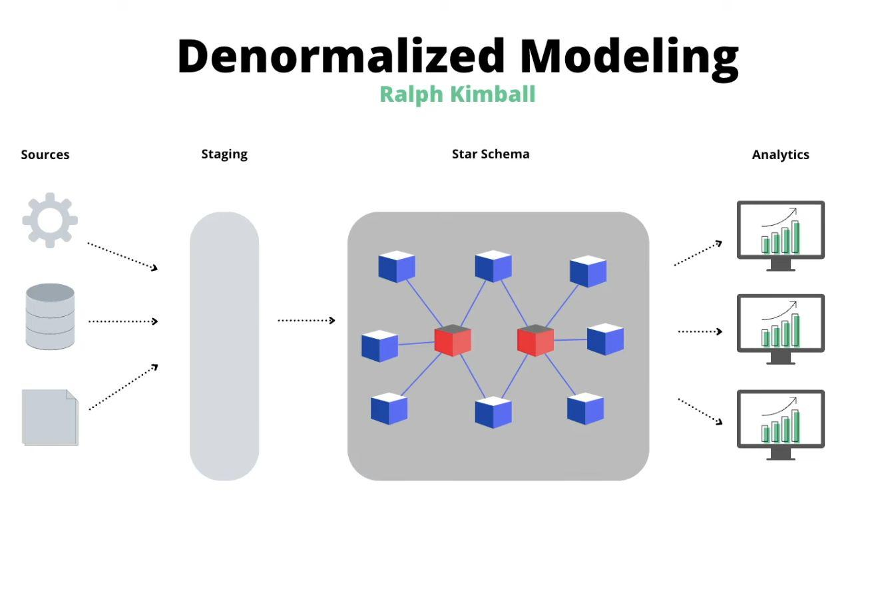

- **Approach:** Build denormalized Star Schemas directly for analytics. Facts (metrics) at the center, Dimensions (context) around them.
- **Flow:** Sources → Staging → Star Schema → Analytics
- **Pro:** Fast query performance, easy for analysts to understand
- **Con:** Data redundancy, multiple sources of truth possible
- **Key concepts:** Fact tables, Dimension tables, Star Schema, Snowflake Schema

---

### 3. Data Vault 2.0 — Hubs, Links & Satellites

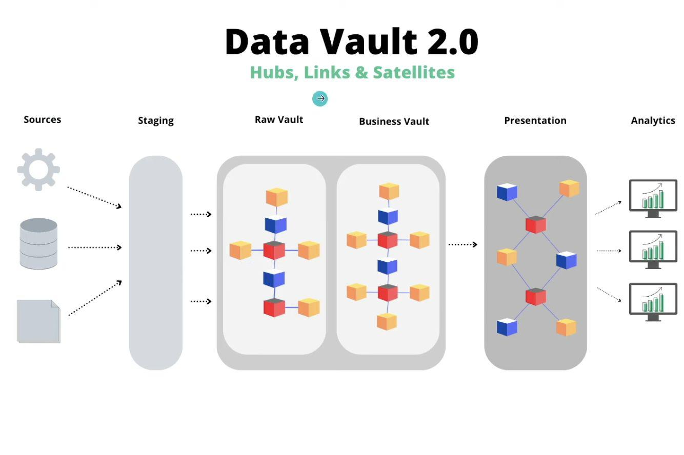

- **Approach:** Highly scalable and auditable modeling technique designed for the modern data warehouse.
- **Components:**
  - **Hubs** — unique business keys (e.g., customer ID)
  - **Links** — relationships between hubs
  - **Satellites** — descriptive attributes + history
- **Flow:** Sources → Staging → Raw Vault → Business Vault → Presentation → Analytics
- **Pro:** Audit trail, easy to add new sources, handles change well
- **Con:** Complex, verbose, requires tooling

---

### 4. One-Big-Table (OBT) — Flatten Straight to Wide Tables

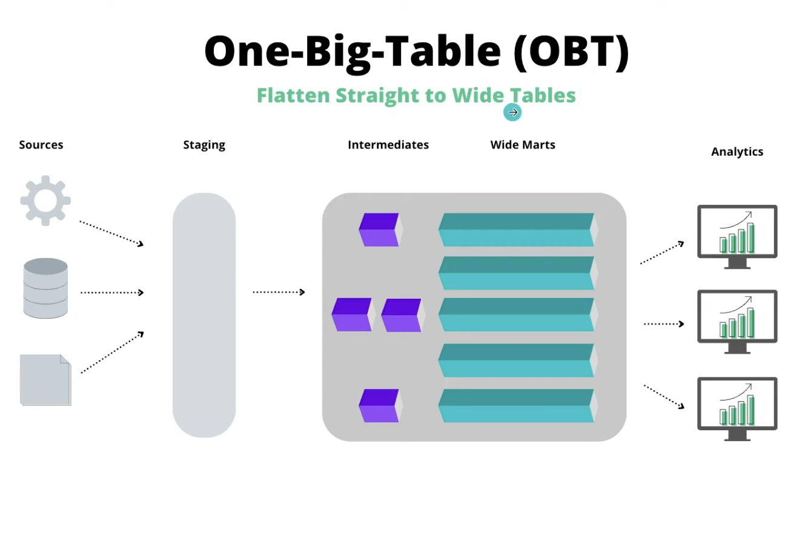

- **Approach:** Denormalize everything into a single wide table. Popular with columnar stores like BigQuery, Snowflake, DuckDB.
- **Flow:** Sources → Staging → Intermediates → Wide Marts → Analytics
- **Pro:** Extremely fast for analytics, simple for end users
- **Con:** Huge storage, not flexible for changing business logic

---

### 5. Hybrid Approach — Star Schema with Wide Marts

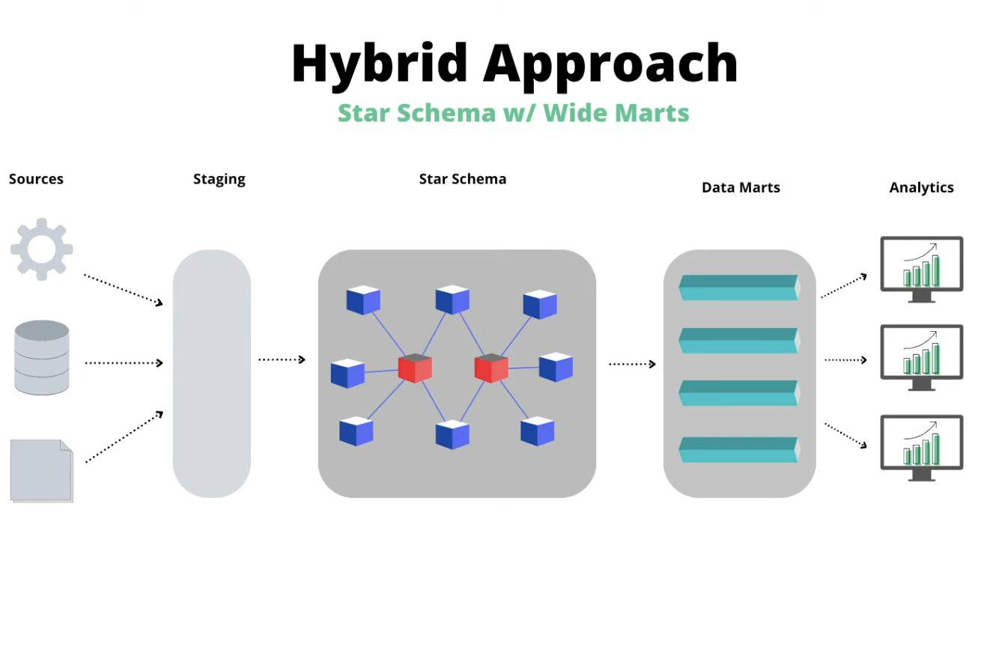

- **Approach:** Combine Kimball's Star Schema structure with wide denormalized data marts for specific use cases.
- **Flow:** Sources → Staging → Star Schema → Data Marts (wide) → Analytics
- **Best of both worlds:** Structured core model + wide marts for performance-critical workloads

---

## Data Warehouse Architectures

### 6. Modern Data Warehouse — Generic Pattern

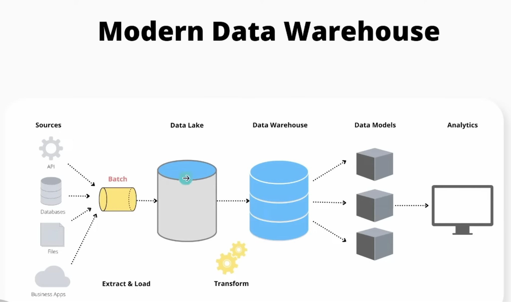

- **Flow:** Sources → Data Lake → Data Warehouse → Data Models → Analytics
- **Key step:** ELT (Extract, Load, Transform) — load raw into lake first, then transform inside the warehouse
- Tools: dbt for transformation, Snowflake/BigQuery/Redshift as warehouse

---

### 7. Modern Data Warehouse — Delta Lake (Example 3)

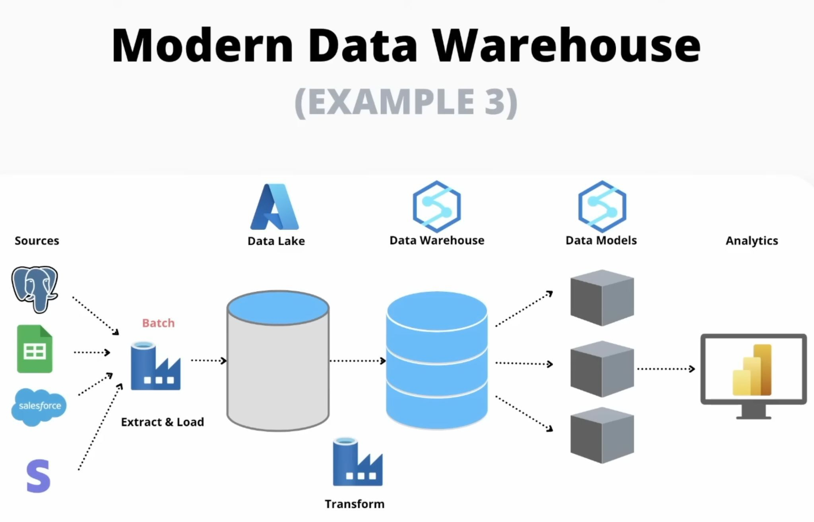

- Uses **Delta Lake** as the storage layer: ACID transactions on Parquet files → Delta Tables
- Sources: PostgreSQL, Google Sheets, Salesforce, Stripe
- Stack: Airbyte (Extract & Load) → Azure Data Lake → Azure Synapse (DW) → Data Models

---

### 8. Traditional Pipeline

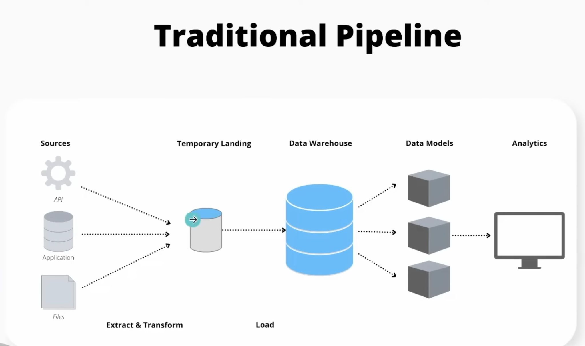

- **Flow:** Sources → Temporary Landing (ETL) → Data Warehouse → Data Models → Analytics
- **Key difference from modern:** Transform happens BEFORE loading (ETL, not ELT)
- Sources: API, Application, Files → Extract & Transform → Load into DW

---

### 9. Modern Data Warehouse — Snowflake (Example 1)

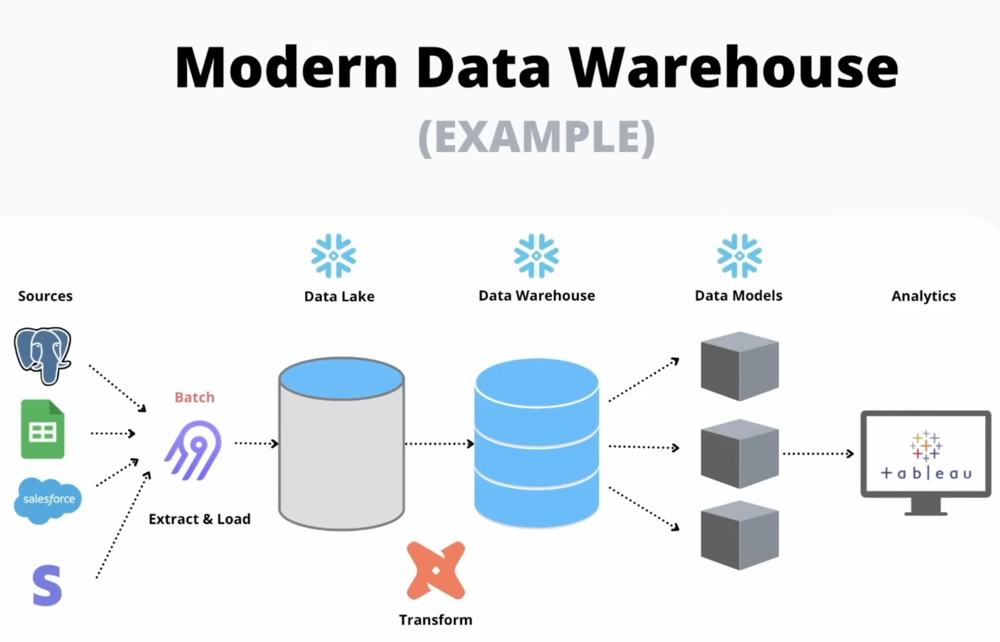

- Sources: PostgreSQL, Google Sheets, Salesforce, Stripe
- Stack: Airbyte (EL) → Snowflake (Data Lake + DW + Models) → Tableau (Analytics)

---

### 10. Modern Data Warehouse — AWS S3 (Example 2)

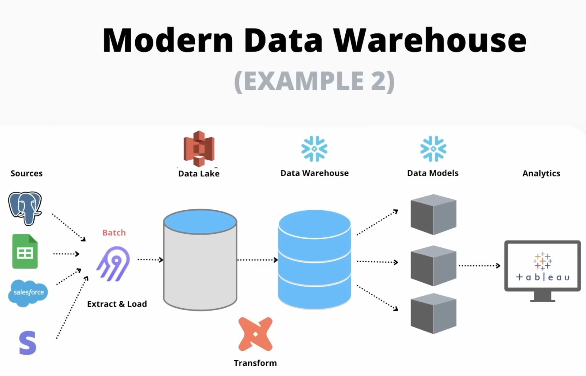

- Sources: PostgreSQL, Google Sheets, Salesforce, Stripe
- Stack: Airbyte (EL) → S3 (Data Lake) → Redshift/Snowflake (DW + Models) → Tableau

---

## Batch vs Stream / Lambda Architecture

### 11. Lambda Architecture

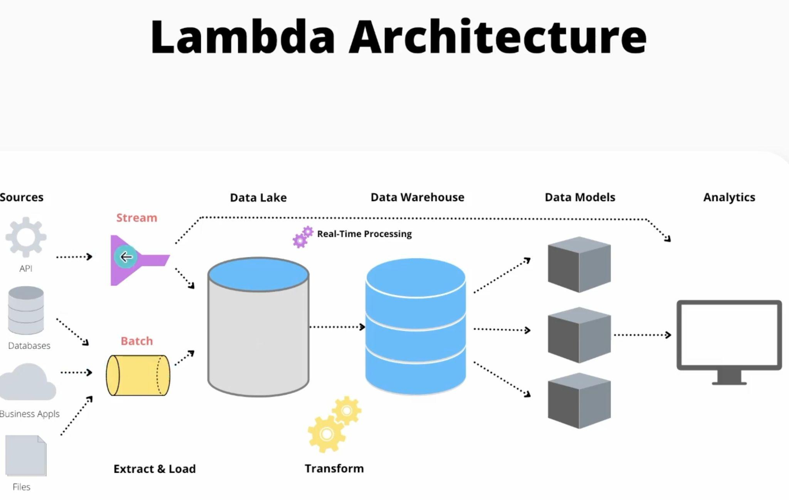

- **Two parallel paths:**
  - **Stream layer** — real-time processing (low latency)
  - **Batch layer** — periodic bulk processing (high throughput)
- Both feed into the Data Warehouse → Models → Analytics
- **Exactly-once semantics** — each event is processed exactly one time (idempotent producers + transactional writes)

---

### 12. Lambda Architecture — Example 1 (Kafka + Spark)

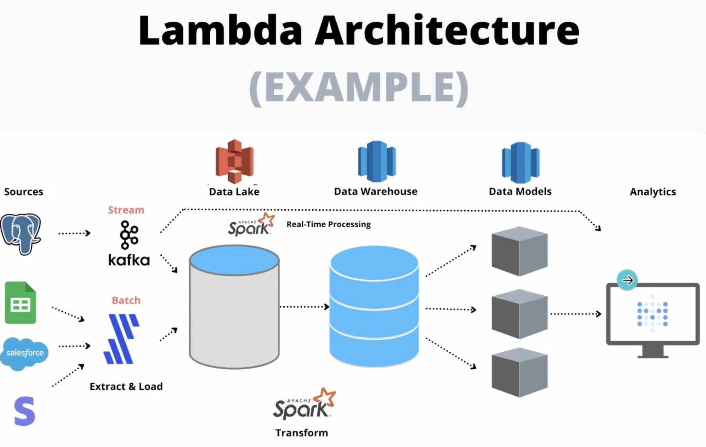

- **Stream:** Kafka → Apache Spark (real-time processing) → S3 (Data Lake)
- **Batch:** Airbyte → S3 (Data Lake)
- **Transform:** Spark → Redshift (DW) → Data Models → Databricks BI

---

### 13. Lambda Architecture — Example 2

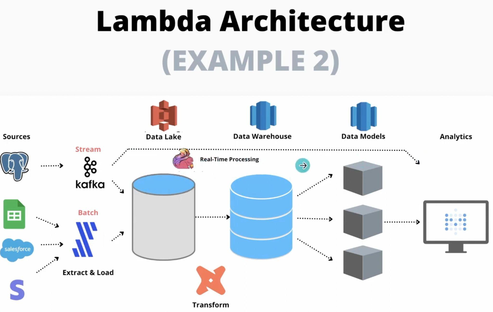

- **Stream:** Kafka → Flink/custom processor → S3 (Data Lake)
- **Batch:** Airbyte → S3
- Same downstream: DW → Models → Analytics

---

## Databricks Reference Architectures

### 14. Data Ingestion Reference Architecture — Databricks

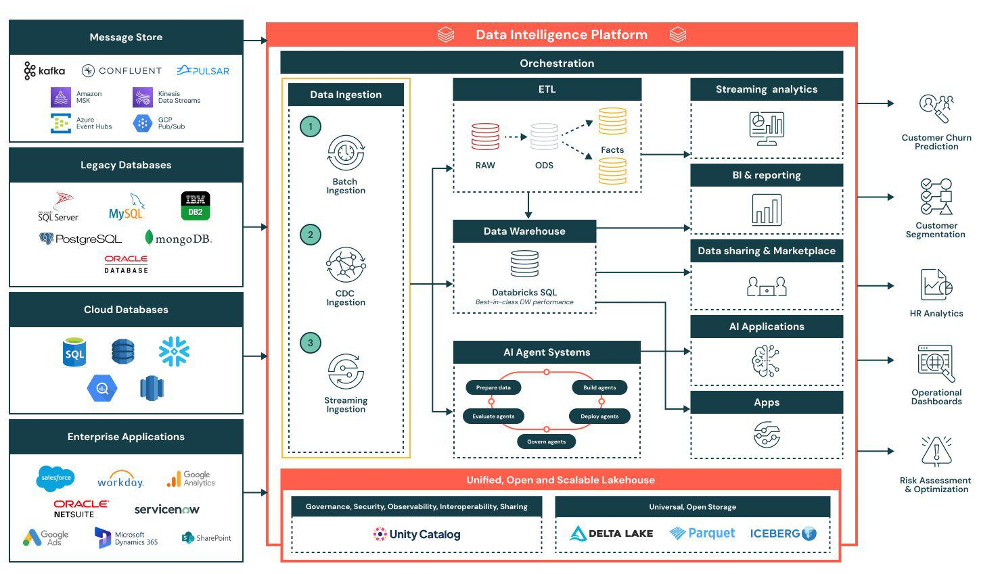

- **3 ingestion patterns:**
  1. **Batch Ingestion** — periodic bulk loads
  2. **CDC Ingestion** — Change Data Capture (captures row-level changes)
  3. **Streaming Ingestion** — real-time event streams
- **Sources:** Message stores (Kafka, Confluent, Pulsar, Kinesis), Legacy DBs, Cloud DBs, Enterprise Apps
- **Platform:** Unity Catalog (governance) + Delta Lake / Parquet / Iceberg (open storage)
- **Outputs:** Customer Churn Prediction, Customer Segmentation, HR Analytics, Operational Dashboards, Risk Assessment

---

### 15. Intelligent Data Warehousing on Databricks

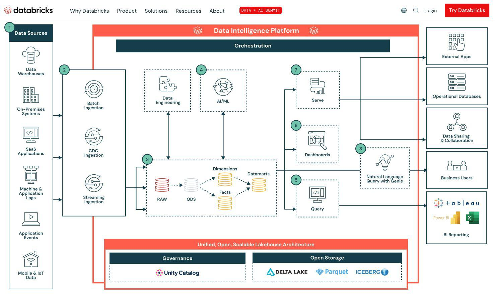

- **End-to-end Databricks lakehouse:**
  1. Data Sources (DW, On-Prem, SaaS, Logs, Events, IoT)
  2. Ingestion: Batch, CDC, Streaming
  3. RAW → ODS → Facts + Dimensions → Datamarts
  4. Data Engineering + AI/ML workloads in parallel
  5. Serve: Dashboards, Query, Natural Language (Genie)
  6. Outputs: Tableau, Power BI, External Apps, Business Users
- **Foundation:** Unity Catalog + Delta Lake + Parquet + Iceberg
