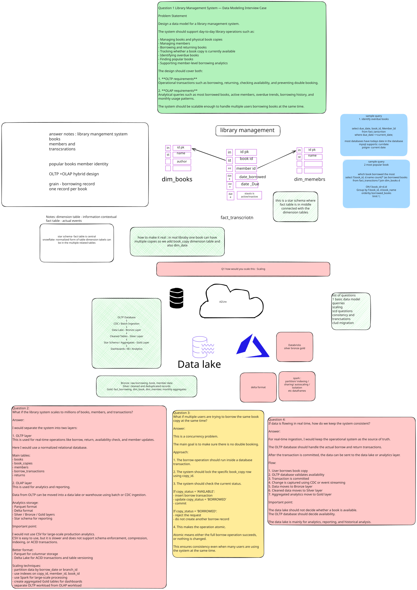
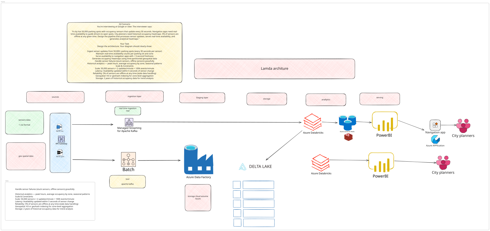
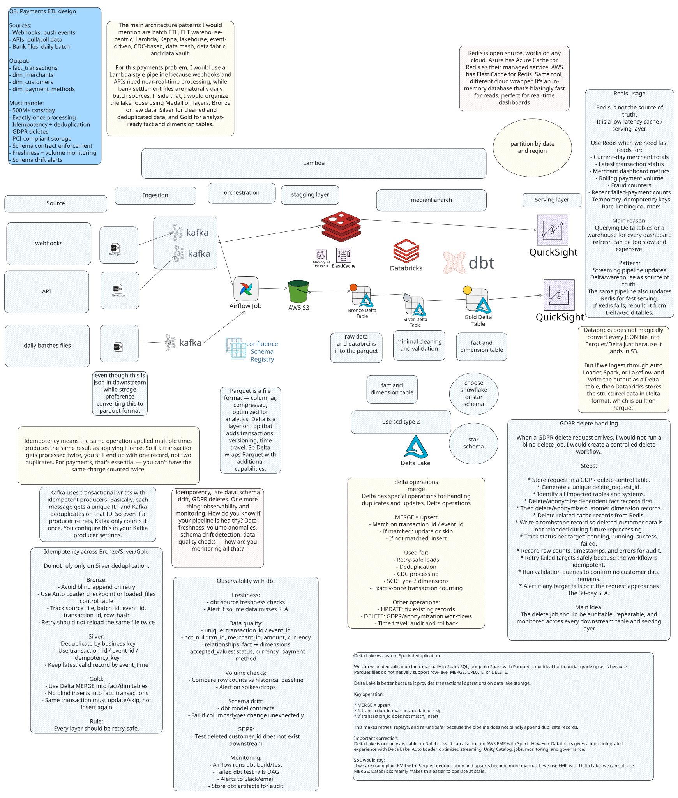

# Data Modeling Interview Questions — Excalidraw Diagrams

This folder contains data modeling interview case studies with diagrams drawn in Excalidraw.

---

## Q1 — Library Management System

**File:** `Q1_library_management_system.excalidraw` | `Q1.svg`

### Problem Statement

Design a data model for a library management system.

The system should support day-to-day library operations such as:

- Managing books and physical book copies
- Managing members
- Borrowing and returning books
- Tracking whether a book copy is currently available
- Identifying overdue books
- Finding popular books
- Supporting member-level borrowing analytics

The design should cover both:

**1. OLTP Requirements**
Operational transactions such as borrowing, returning, checking availability, and preventing double booking.

**2. OLAP Requirements**
Analytical queries such as most borrowed books, active members, overdue trends, borrowing history, and monthly usage patterns.

The system should be scalable enough to handle multiple users borrowing books at the same time.

### Key Entities

| Entity | Purpose |
|---|---|
| `Book` | Master record for a title (ISBN, title, author, genre) |
| `BookCopy` | Physical copy of a book — tracks availability status |
| `Member` | Library member profile |
| `Loan` | Borrow/return transaction linking a member to a copy |
| `Overdue` | Derived view or flag for copies not returned by due date |

### OLTP Design Decisions

- `BookCopy` has a `status` field (`available` / `borrowed` / `lost`) updated atomically on borrow/return
- `Loan` table records `borrowed_at`, `due_date`, `returned_at` — null `returned_at` means still out
- Concurrent borrows prevented by locking the `BookCopy` row on status check + update (optimistic or pessimistic locking)
- One loan per active copy enforced via unique constraint on `(copy_id, returned_at IS NULL)`

### OLAP Design Decisions

- Fact table: `fact_loans` — grain is one row per loan event
- Dimensions: `dim_book`, `dim_member`, `dim_date`
- Metrics derivable: total borrows per book, active members per month, overdue rate, avg loan duration
- Popular books: `COUNT(loan_id) GROUP BY book_id` over a time window
- Overdue trend: `COUNT(*) WHERE returned_at IS NULL AND due_date < CURRENT_DATE GROUP BY due_date`

### Diagram

---

## Q2 — City Parking Sensor Pipeline (Lambda Architecture)

**File:** `Q2_parking_sensor_pipeline.excalidraw` | `Q2.svg`

### Problem Statement

A city has 50,000 parking spots with occupancy sensors that update every 30 seconds. Navigation apps need real-time availability to guide drivers to open spots. City planners need historical occupancy heatmaps. 5% of sensors are offline at any given time. Design the pipeline that processes sensor updates, serves real-time availability, and generates analytical heatmaps.

### Requirements

- Ingest sensor updates from 50,000+ parking spots (every 30s per sensor)
- Maintain real-time availability counts per parking lot and zone
- Serve availability to navigation apps with < 5-second freshness
- Generate occupancy heatmaps using time-partitioned geospatial data
- Handle sensor failures (stuck sensors, offline sensors) gracefully
- Historical analytics — peak hours, average occupancy by zone, seasonal patterns

### Scale & Constraints

| Constraint | Value |
|---|---|
| Throughput | 50,000 sensors × 2 updates/min = 100K events/minute |
| Latency | Availability updated within 5 seconds of sensor change |
| Reliability | 5% of sensors offline at any time (stale data handling) |
| Geospatial | H3 or geohash indexing for zone-level aggregation |
| Storage | 2 years of historical occupancy data for trend analysis |

### Architecture: Lambda Pattern

**Speed Layer (real-time path)**
- Sources → API Gateway / Kafka Connect → Azure Managed Kafka → Azure Databricks (Structured Streaming) → Azure Cache for Redis → PowerBI (live dashboard) + Navigation App (REST API)

**Batch Layer (historical path)**
- Sources → Batch ingest (ADF / Kafka) → Azure Data Factory → Delta Lake (bronze/silver/gold) → Azure Databricks (dbt) → PowerBI (heatmap reports) → City Planners

### Key Design Decisions

- **Delta Lake medallion architecture**: bronze (raw), silver (validated, deduped), gold (aggregated by geohash/H3 zone)
- **Redis** for sub-5s availability serving to navigation apps
- **H3/geohash** partitioning on gold layer for efficient zone-level queries
- **Sensor failure handling**: watermarking + last-seen-at timestamps; stale sensors flagged after 2× update interval (60s)
- **Structured Streaming** with exactly-once semantics for real-time counts

### Diagram

---

## Q3 — Payments ETL Pipeline (Lambda + Lakehouse)

**File:** `Q3_payments_etl_pipeline.excalidraw` | `Q3.svg`

**Difficulty:** Hard | **Company:** Stripe / PayPal

### Problem Statement

You're interviewing at a payments company like Stripe or PayPal. The interviewer says:

> "We receive payment data from multiple sources — webhooks that push events to us, APIs we poll, and bank settlement files that arrive as daily batches. I need you to design an ETL pipeline that transforms all of this into analyst-ready fact and dimension tables. Every transaction must be counted exactly once — retries and replays can't create duplicates. We also need GDPR delete capability and schema drift detection. Design this."

### Requirements

- Ingest from multiple sources — webhooks (push), API polling (pull), bank settlement files (batch)
- Transform into dimensional model — `fact_transactions`, `dim_merchants`, `dim_customers`, `dim_payment_methods`
- Enforce idempotency — retries and replays must not create duplicates
- GDPR delete propagation through all downstream tables
- Schema contract enforcement between upstream producers and the pipeline
- Observability — data freshness, volume anomalies, schema drift detection

### Scale & Constraints

| Constraint | Value |
|---|---|
| Throughput | 500M+ daily transactions across millions of merchants |
| Correctness | Financial-grade accuracy, zero tolerance for duplicates |
| Compliance | GDPR deletes within 30 days, PCI-DSS for storage |
| Freshness | Hourly for merchant dashboards, daily for financial reporting |
| Schema | Upstream API changes break the pipeline — need contract enforcement |

### Architecture: Lambda + Lakehouse Pattern

**Ingestion**
- Webhooks → Kafka (push events, transactional writes with idempotent producers)
- APIs → Kafka (polled pull data)
- Bank settlement files → Kafka (daily batch files)
- All sources → Confluent Schema Registry for schema contract enforcement

**Staging Layer**
- Kafka → Airflow Job → AWS S3 (raw JSON converted to Parquet)
- AWS S3 → Bronze Delta Table (raw data, avoid blind append on retry, track `source_file`, `batch_id`, `event_id`, `transaction_id`, `idempotency_key`)

**Processing**
- Bronze → Silver Delta Table (deduplicated by business key using `transaction_id / event_id / idempotency_key`, keep latest valid record by `event_time`)
- Silver → Gold Delta Table (fact and dimension tables, Delta MERGE into `fact/dim` tables, SCD Type 2 for dimensions)
- Databricks + dbt for transformation and orchestration

**Serving Layer**
- Gold Delta Table → QuickSight (analyst dashboards, financial reporting)
- Gold/Delta → Redis (low-latency cache for merchant dashboards — current-day totals, latest transaction status, rolling payment volume, fraud counters)
- Redis rebuilt from Gold/Delta tables if it fails

### Key Design Decisions

**Idempotency**
- Kafka uses transactional writes with idempotent producers — each message gets a unique `transaction_id`, Kafka deduplicates on that ID
- Bronze: avoid blind append on retry, use Auto Loader or `loaded_files` control table
- Silver: deduplicate by business key (`transaction_id / event_id / idempotency_key`)
- Gold: use Delta MERGE — same transaction must update/skip, not insert again
- Every layer is retry-safe

**Delta Lake vs Custom Spark Deduplication**
- Delta MERGE = upsert: if `transaction_id` matches → update or skip; if not → insert
- Plain Spark with Parquet is not ideal for financial-grade upserts (no row-level MERGE, UPDATE, DELETE)
- Delta provides transactional operations on data lake storage, making retries and replays safe
- Delta Lake runs on AWS EMR with Spark too, but Databricks gives more integrated experience with Unity Catalog, jobs, and governance

**Medallion Layers**
- Bronze: raw data, Parquet format (converted from JSON at ingestion)
- Silver: minimal cleaning and validation, deduplicated
- Gold: analyst-ready fact and dimension tables (snowflake or star schema)

**Schema Contract Enforcement (via dbt + Schema Registry)**
- Confluent Schema Registry enforces contracts at ingestion
- dbt model contracts: fail if columns/types change unexpectedly
- Alerts on schema drift before it breaks downstream

**GDPR Delete Handling**
- Store delete request in a GDPR delete control table (unique `delete_request_id`, `customer_id`)
- Identify all impacted tables and systems
- Delete/anonymize dependent fact records first, then delete customer dimension records
- Delete related cache records from Redis
- Write a tombstone record so deleted customer data is not reloaded during future reprocessing
- Track status per target: pending, running, success, failed
- Retry failed targets safely (workflow is idempotent)
- Record row counts, timestamps, and errors for audit
- Run validation queries to confirm no customer data remains
- Alert if any target fails or the request approaches the 30-day SLA
- The delete job must be auditable, repeatable, and monitored across every downstream table and serving layer

**Redis Usage**
- Redis is not the source of truth — it is a low-latency cache / serving layer
- Use Redis for: current-day merchant totals, latest transaction status, merchant dashboard metrics, rolling payment volume, fraud counters, recent failed-payment counts, temporary idempotency keys, rate-limiting counters
- If Redis fails → rebuild it from Delta/Gold tables
- Pattern: streaming pipeline updates Delta/warehouse as source of truth, same pipeline also updates Redis for fast serving

**Observability with dbt**
- Freshness: dbt source freshness checks, alert if source data misses SLA
- Data quality: unique `transaction_id / event_id`, not-null `txn_id / merchant_id / amount / currency`, relationships fact → dimensions, accepted values for `status / currency / payment_method`
- Volume checks: compare row counts vs historical baseline, alert on spikes/drops
- Schema drift: dbt model contracts, fail if columns/types change unexpectedly
- GDPR: test deleted `customer_id` does not exist downstream
- Monitoring: Airflow runs dbt build/test, failed dbt test fails DAG, alerts to Slack/email, store dbt artifacts for audit

### Output Tables

| Table | Description |
|---|---|
| `fact_transactions` | One row per payment transaction, financial-grade accuracy |
| `dim_merchants` | Merchant profiles with SCD Type 2 history |
| `dim_customers` | Customer profiles (GDPR-compliant, anonymizable) |
| `dim_payment_methods` | Payment method attributes |

### Diagram

---
